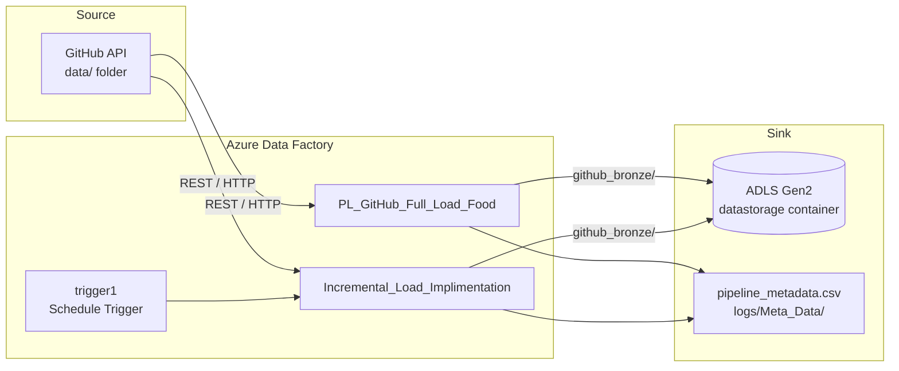
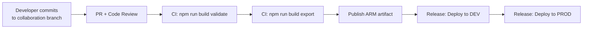

# Azure Fabric Data Pipelines

Production-grade **Azure Data Factory (ADF)** Git-integrated repository for ingesting CSV datasets from GitHub into **Azure Data Lake Storage Gen2 (ADLS)**. The solution implements a full-load and incremental-load pattern with SHA-based change detection, metadata tracking, and automated scheduling.

---

## Table of Contents

- [Overview](#overview)
- [Architecture](#architecture)
- [Repository Structure](#repository-structure)
- [Pipelines](#pipelines)
- [Data Sources and Destinations](#data-sources-and-destinations)
- [Prerequisites](#prerequisites)
- [Getting Started](#getting-started)
- [Local Development](#local-development)
- [Validation and ARM Export](#validation-and-arm-export)
- [CI/CD and Deployment](#cicd-and-deployment)
- [Configuration](#configuration)
- [Security](#security)
- [Operations and Monitoring](#operations-and-monitoring)
- [Troubleshooting](#troubleshooting)

---

## Overview

This project automates the movement of CSV files from a GitHub repository into a bronze layer on ADLS. It is designed for repeatable, auditable data ingestion with:

- **Full load** — initial ingestion of all files with per-file metadata capture.
- **Incremental load** — SHA-based change detection to copy only new or modified files.
- **Metadata lineage** — a persistent CSV audit log stored in ADLS for run history and change tracking.
- **Git-native authoring** — all ADF resources are version-controlled as JSON and deployed via ARM templates.

| Component | Count |
|-----------|-------|
| Pipelines | 2 |
| Datasets | 4 |
| Linked Services | 3 |
| Triggers | 1 |
| Source CSV files | 8 |

---

## Architecture



### Data flow

1. **Full load** (`PL_GitHub_Full_Load_Food`) lists all files in the GitHub `data/` folder, copies each file to ADLS, and writes a metadata row per file (run ID, file name, SHA, status, row counts, timestamp).
2. **Incremental load** (`Incremental_Load_Implimentation`) fetches the current GitHub file list, compares each file's SHA against the last recorded SHA in the metadata CSV, and copies only changed or new files.
3. **Trigger** (`trigger1`) runs the incremental pipeline on a schedule.

---

## Repository Structure

```
.
├── .cursor/
│   └── environment.json          # Cloud Agent dev environment config
├── build/
│   ├── package.json              # ADF utilities (validate / export)
│   └── package-lock.json
├── data/                         # Source CSV datasets (Git LFS)
│   ├── food.csv
│   ├── menu.csv
│   ├── orders.csv
│   ├── org.csv
│   ├── people.csv
│   ├── restaurant.csv
│   ├── reviews.csv
│   └── users.csv
├── dataset/                      # ADF dataset definitions
├── linkedService/                # ADF linked service definitions
├── pipeline/                     # ADF pipeline definitions
├── trigger/                      # ADF trigger definitions
├── publish_config.json           # ADF publish branch configuration
├── .gitattributes                # Git LFS tracking rules for data/
└── .gitignore
```

---

## Pipelines

### `PL_GitHub_Full_Load_Food`

Performs a complete ingestion of all CSV files from the GitHub `data/` folder.

| Step | Activity | Description |
|------|----------|-------------|
| 1 | `Web_Get_GitHub_Files` | Lists files via GitHub Contents API |
| 2 | `Iterate_Through_All_Files` | ForEach loop over each file |
| 3 | `Copy data1` | Copies file from GitHub to ADLS (`github_bronze/`) |
| 4 | `Append_On_Success` / `Append_On_Failure` | Records per-file metadata |
| 5 | `Write_Metadata_To_Blob` | Appends metadata rows to `pipeline_metadata.csv` |

**Pipeline parameters:**

| Parameter | Default | Description |
|-----------|---------|-------------|
| `pStorageAccountName` | `practicefullload` | Target ADLS storage account |
| `pLogContainer` | `datastorage` | ADLS file system (container) |
| `pMetadataFilePath` | `logs/Meta_Data/pipeline_metadata.csv` | Metadata CSV path |

### `Incremental_Load_Implimentation`

Runs after the full load to ingest only changed files.

| Step | Activity | Description |
|------|----------|-------------|
| 1 | `Incremental_Load_Web_Activity` | Fetches current GitHub file list with SHAs |
| 2 | `Lookup_Metadata` | Reads existing metadata CSV from ADLS |
| 3 | `Iterate_Through_All_Files` | ForEach file: compare SHA, copy if changed |
| 4 | `If_Any_File_Copied` | Appends metadata only when files were copied |

**Change detection logic:** A file is copied when it has no prior metadata row (new file) or when its GitHub SHA differs from the last recorded SHA (modified file). Unchanged files are skipped with no metadata write.

### `trigger1`

| Property | Value |
|----------|-------|
| Type | Schedule Trigger |
| Pipeline | `Incremental_Load_Implimentation` |
| Frequency | Every 15 days at 12:12 IST |
| Active window | 2026-09-01 → 2026-10-02 |
| Runtime state | Started |

---

## Data Sources and Destinations

### Source — GitHub

| Linked Service | Type | Endpoint |
|----------------|------|----------|
| `LS_GitHub_API` | RestService | `https://api.github.com` |
| `LS_GitHub_HTTP` | HttpServer | `https://media.githubusercontent.com` |

Source repository: `Shreeshail-sp/azure-fabric-data-pipelines` (branch: `main`, folder: `data/`).

### Destination — Azure Data Lake Storage Gen2

| Linked Service | Type | Endpoint |
|----------------|------|----------|
| `AzureDataLakeStorage1` | AzureBlobFS | `https://practicefullload.dfs.core.windows.net/` |

| Dataset | ADLS Path | Purpose |
|---------|-----------|---------|
| `DS_ADLS_Food` | `datastorage/github_bronze/{fileName}` | Bronze-layer CSV files |
| `DS_ADLS_Metadata` | `datastorage/logs/Meta_Data/pipeline_metadata.csv` | Ingestion audit log |

### Source datasets (GitHub)

| Dataset | Type | Purpose |
|---------|------|---------|
| `DS_GitHub_Data_Folder` | RestResource | Parameterized GitHub file access |
| `DS_Github_Data` | DelimitedText (HTTP) | Direct HTTP CSV read |

---

## Prerequisites

| Tool | Version | Purpose |
|------|---------|---------|
| [Node.js](https://nodejs.org/) | 18.x or 20.x+ (LTS) | ADF utilities runtime |
| [Git](https://git-scm.com/) | Latest | Source control |
| [Git LFS](https://git-lfs.github.com/) | Latest | Large CSV files in `data/` |
| Azure subscription | — | ADF and ADLS resources |
| Azure Data Factory instance | — | Pipeline execution target |

---

## Getting Started

### 1. Clone the repository

```bash
git clone https://github.com/Shreeshail-sp/azure-fabric-data-pipelines.git
cd azure-fabric-data-pipelines
```

### 2. Pull large data files (Git LFS)

Several CSV files in `data/` are tracked with Git LFS:

```bash
git lfs install
git lfs pull
```

### 3. Install build tooling

```bash
cd build
npm install
```

### 4. Connect to Azure Data Factory

In the [Azure Portal](https://portal.azure.com), open your Data Factory instance and configure **Git integration** pointing to this repository with the repository root as the ADF root folder.

---

## Local Development

This repository uses Microsoft's official [`@microsoft/azure-data-factory-utilities`](https://www.npmjs.com/package/@microsoft/azure-data-factory-utilities) package for local validation and ARM template generation — the CLI equivalent of **Validate All** and **Publish** in the ADF UI.

All commands run from the `build/` directory:

```bash
cd build
```

### Cloud Agent environment

Cursor Cloud Agents automatically run `cd build && npm install` on startup via `.cursor/environment.json`. No additional setup is required for agent-based development.

---

## Validation and ARM Export

Set your factory resource ID (replace placeholders with your Azure values):

```bash
export FACTORY_ID="/subscriptions/<subscription-id>/resourceGroups/<resource-group>/providers/Microsoft.DataFactory/factories/<factory-name>"
```

### Validate all resources

Equivalent to **Validate All** in the ADF authoring UI:

```bash
npm run build validate .. "$FACTORY_ID"
```

Expected output:

```
Validation finished. No errors found.
```

### Export ARM template

Equivalent to **Publish** in the ADF authoring UI. Generates deployable artifacts under `build/ArmTemplate/`:

```bash
npm run build export .. "$FACTORY_ID" ArmTemplate
```

Generated artifacts:

| File | Purpose |
|------|---------|
| `ARMTemplateForFactory.json` | Master ARM template |
| `ARMTemplateParametersForFactory.json` | Deployment parameters |
| `linkedTemplates/ArmTemplate_0.json` | Linked resource template |
| `PrePostDeploymentScript.ps1` | Trigger stop/start during deployment |
| `GlobalParametersUpdateScript.ps1` | Global parameter updates |

> Generated ARM output is excluded from version control via `.gitignore`.

---

## CI/CD and Deployment

### Recommended pipeline stages



### Azure DevOps example

```yaml
# adf-build-job.yml (simplified)
steps:
  - task: NodeTool@0
    inputs:
      versionSpec: '20.x'

  - script: npm install
    workingDirectory: build

  - script: |
      npm run build validate $(Build.Repository.LocalPath) \
        /subscriptions/$(SUBSCRIPTION_ID)/resourceGroups/$(RG_NAME)/providers/Microsoft.DataFactory/factories/$(FACTORY_NAME)
    workingDirectory: build
    displayName: 'Validate ADF resources'

  - script: |
      npm run build export $(Build.Repository.LocalPath) \
        /subscriptions/$(SUBSCRIPTION_ID)/resourceGroups/$(RG_NAME)/providers/Microsoft.DataFactory/factories/$(FACTORY_NAME) \
        ArmTemplate
    workingDirectory: build
    displayName: 'Export ARM template'

  - task: PublishPipelineArtifact@1
    inputs:
      targetPath: build/ArmTemplate
      artifact: adf-arm-template
```

### Deployment order

1. Deploy linked services (ADLS credentials, GitHub endpoints).
2. Deploy datasets.
3. Deploy pipelines.
4. Run `PrePostDeploymentScript.ps1` (stops triggers, deploys, restarts triggers).
5. Enable triggers in the target environment.

### Environment promotion

| Environment | Purpose | Trigger state |
|-------------|---------|---------------|
| DEV | Development and integration testing | Disabled or manual |
| STAGING | Pre-production validation | Disabled |
| PROD | Production ingestion | Enabled per schedule |

Use [ARM template parameterization](https://learn.microsoft.com/en-us/azure/data-factory/continuous-integration-delivery-improvements) to override storage account names, container paths, and trigger schedules per environment. Add an `arm-template-parameters-definition.json` at the repository root to control which properties become deployment parameters.

---

## Configuration

### `publish_config.json`

```json
{
  "publishBranch": "adf_publish"
}
```

Specifies the ADF publish branch used when generating ARM templates from the ADF UI or utilities.

### Pipeline parameters

Override at runtime or via ARM template parameters for environment-specific values:

| Parameter | DEV example | PROD example |
|-----------|-------------|--------------|
| `pStorageAccountName` | `devfullload` | `practicefullload` |
| `pLogContainer` | `datastorage` | `datastorage` |
| `pMetadataFilePath` | `logs/Meta_Data/pipeline_metadata.csv` | `logs/Meta_Data/pipeline_metadata.csv` |

### Metadata schema

The `pipeline_metadata.csv` file tracks every ingestion event:

| Column | Description |
|--------|-------------|
| `RunId` | ADF pipeline run identifier |
| `FileName` | Source file name |
| `FilePath` | GitHub file path |
| `SHA` | Git blob SHA (change detection watermark) |
| `Status` | `Success`, `Failed`, or `Copied` |
| `RowsCopied` | Number of rows copied |
| `DataRead` | Bytes read from source |
| `DataWritten` | Bytes written to sink |
| `ErrorMessage` | Error details (if failed) |
| `Timestamp` | UTC timestamp of the event |

---

## Security

| Area | Practice |
|------|----------|
| **Credentials** | ADLS linked service uses ADF Key Vault–encrypted credentials. Never commit plaintext secrets, connection strings, or SAS tokens. |
| **Authentication** | Pipelines use Managed Identity (MSI) for ADLS blob operations where configured. |
| **GitHub access** | Source linked services use anonymous access for public repositories. For private repos, configure a Personal Access Token via ADF Key Vault. |
| **Network** | Restrict ADLS access with private endpoints and firewall rules in production. |
| **RBAC** | Grant least-privilege roles: `Storage Blob Data Contributor` for the ADF managed identity on the target container. |
| **Audit** | Metadata CSV provides an ingestion audit trail. Enable ADF diagnostic logs and send to Log Analytics for operational monitoring. |

---

## Operations and Monitoring

### Health checks

- Confirm `trigger1` runtime state is **Started** in the target environment.
- Verify recent pipeline runs in the ADF **Monitor** blade show **Succeeded** status.
- Check `pipeline_metadata.csv` in ADLS for expected file entries and timestamps.

### Re-running a full load

If metadata becomes corrupted or a complete re-ingestion is required:

1. Delete or archive `logs/Meta_Data/pipeline_metadata.csv` in ADLS.
2. Run `PL_GitHub_Full_Load_Food` manually.
3. Resume incremental loads via `Incremental_Load_Implimentation`.

### Alerting (recommended for production)

| Alert | Condition |
|-------|-----------|
| Pipeline failure | Any pipeline run status = Failed |
| Trigger disabled | Trigger runtime state changes to Stopped |
| No successful run | No succeeded run within expected schedule window |
| Metadata gap | No new metadata rows when source files have changed |

Configure alerts via Azure Monitor on ADF diagnostic settings.

---

## Troubleshooting

| Symptom | Likely cause | Resolution |
|---------|--------------|------------|
| `Validation finished` reports errors | Invalid JSON, missing dataset reference, or broken expression | Run `npm run build validate` locally and fix reported resource errors |
| Incremental load copies all files | Metadata CSV missing or empty | Run full load pipeline first to seed metadata |
| Incremental load skips changed files | SHA not updated in GitHub or metadata out of sync | Verify GitHub commit and inspect metadata CSV for the file's last SHA |
| Copy activity fails with 403 | ADLS permissions or expired credentials | Verify managed identity / service principal has `Storage Blob Data Contributor` on the container |
| GitHub API rate limit (403/429) | Unauthenticated API calls from shared IP | Add authentication to `LS_GitHub_API` or reduce trigger frequency |
| `cd: build: No such file or directory` in Cloud Agent | Environment config on a branch without build tooling | Merge the environment setup branch or ensure `.cursor/environment.json` is on the checked-out branch |
| Large CSV files show LFS pointer text | Git LFS not installed or files not pulled | Run `git lfs install && git lfs pull` |

---

## Contributing

1. Create a feature branch from `main`.
2. Make changes to ADF resource JSON files in the appropriate folders.
3. Validate locally:

   ```bash
   cd build
   npm run build validate .. "$FACTORY_ID"
   ```

4. Open a pull request. Ensure CI validation passes before merging.
5. Deploy via the CI/CD release pipeline after merge to the collaboration branch.

---

## License

This project is maintained as part of the `Shreeshail-sp/azure-fabric-data-pipelines` repository. Add a license file if open-source distribution is intended.
